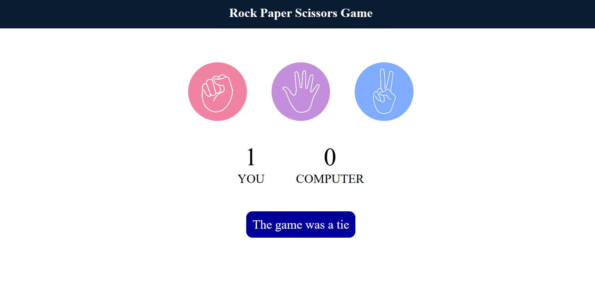

<h1>Rock, Paper, Scissors game</h1>

This is a simple Rock, Paper, Scissors game built using HTML, CSS, and JavaScript. In this game, the player chooses between Rock, Paper, or Scissors and competes against the computer, which randomly picks one of the three options.

<h2>Live Demo</h2>

You can play the game here: [Rock Paper Scissors Game](https://jaya962356.github.io/Rock-Paper-Scissors-Game/)

<h2>How It Works:</h2>

The player chooses either Rock, Paper, or Scissors.

The computer also randomly selects one of the three options.

<h3>The game rules are as follows:</h3>

Rock beats Scissors.

Scissors beats Paper.

Paper beats Rock.

If the player wins, a point is added to their score.

If the computer wins, a point is added to its score.

The game continues with each round, and the score is updated in real-time.

<h2>Features:</h2>

User vs Computer: The player competes against a computer opponent.

Real-time Scoring: Scores are tracked and updated after every round.

Responsive UI: The game interface is styled using CSS for a clean, user-friendly design.

Simple Gameplay: The game is easy to play and suitable for all ages.

<h2>Instructions:</h2>
Choose either Rock, Paper, or Scissors by clicking the corresponding button.

The computer will randomly select its choice, and the result will be displayed.

The score is updated based on the winner of each round.

Continue playing until you decide to stop.

<h3>Example Game Flow:</h3>

Player selects Rock.

Computer selects Scissors.

Player wins and earns 1 point.

Scores are updated accordingly.
